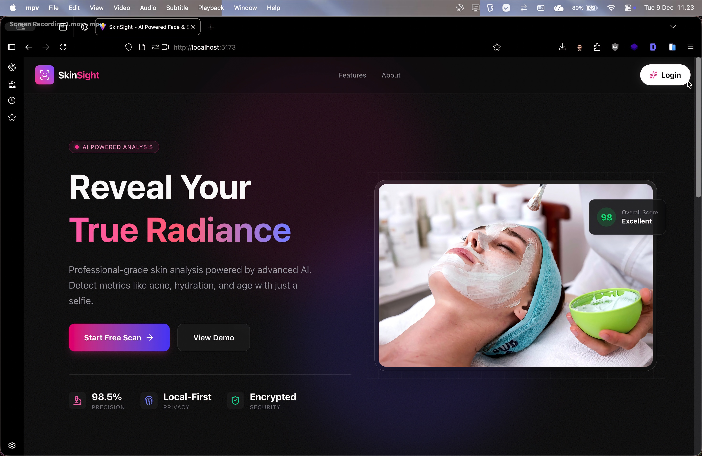
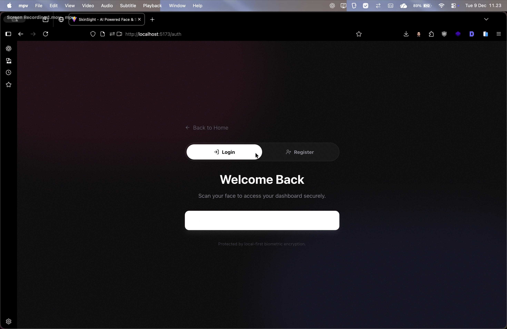
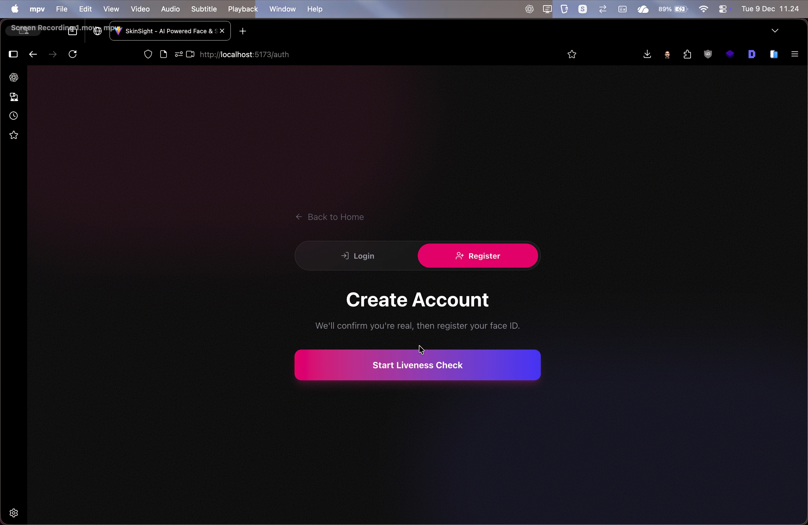
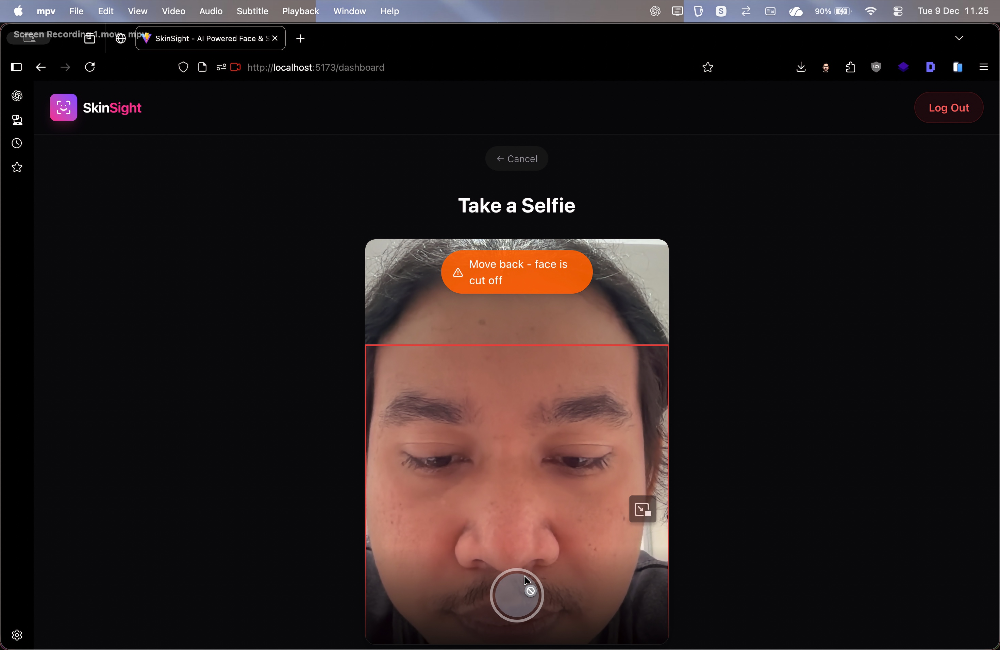
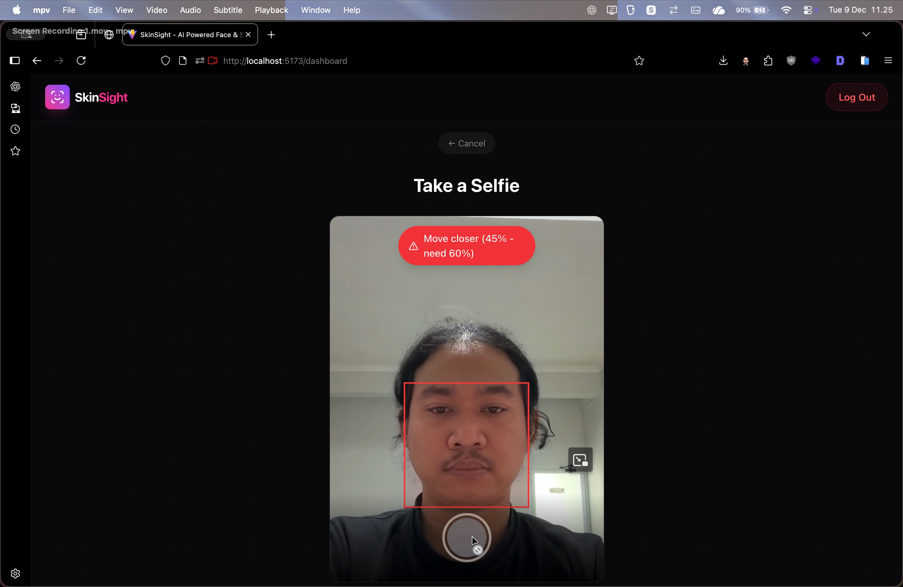
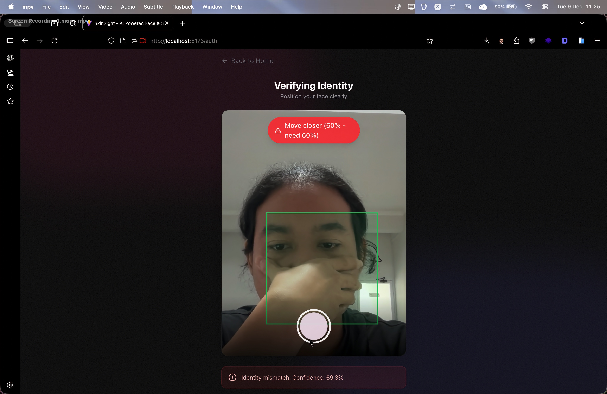
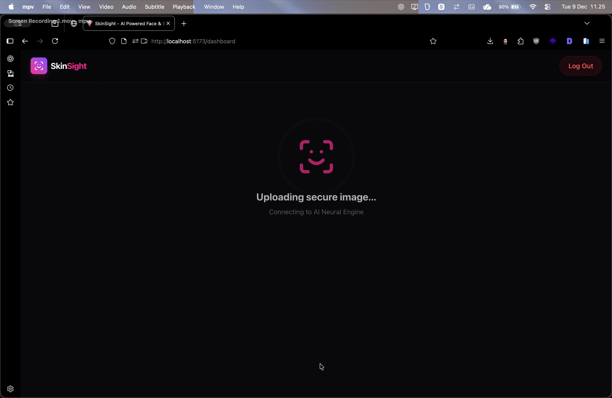
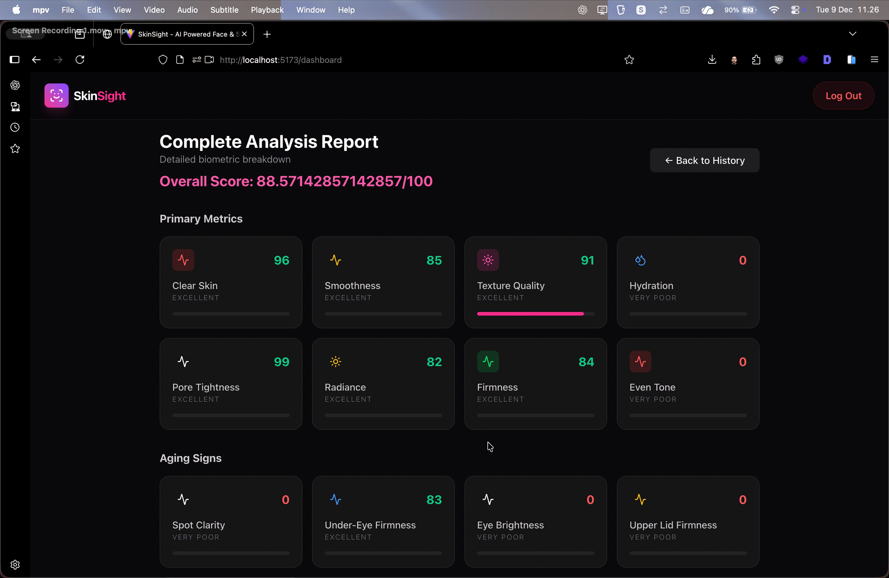

# SkinSight

SkinSight adalah aplikasi web responsif yang dirancang untuk memberikan analisis kulit tingkat medis menggunakan kecerdasan buatan (Artificial Intelligence). Aplikasi ini memanfaatkan integrasi Proof of Concept (PoC) dengan API Perfect Corp untuk mendeteksi berbagai kondisi kulit seperti jerawat, kerutan, tekstur, dan tingkat hidrasi, memberikan wawasan dermatologis yang dapat ditindaklanjuti secara instan kepada pengguna.

## Tinjauan Proyek

Proyek ini berfungsi sebagai demonstrasi antarmuka pengguna premium untuk diagnostik kulit. Ini menekankan pengalaman pengguna yang klinis namun mewah ("Kecantikan Tingkat Medis"), memastikan pengguna merasa dipercaya dan dipedulikan selama proses analisis. Arsitektur teknis dibangun agar siap menjadi Progressive Web App (PWA), memungkinkan kinerja seperti aplikasi native di perangkat seluler.

### Fitur Utama

*   **Analisis Kulit AI**: Mendeteksi berbagai masalah kulit termasuk kadar minyak, pori-pori, dan lingkaran hitam.
*   **Autentikasi Biometrik**: "Login dengan Wajah" yang aman menggunakan API Pengenalan Wajah.
*   **Deteksi Kehidupan (Liveness)**: Sistem Tantangan-Respon (Senyum/Putar Kepala) untuk memastikan kehadiran pengguna asli.
*   **Hasil Instan**: Memberikan umpan balik real-time dan visualisasi metrik kulit.
*   **Laporan PDF**: Menghasilkan dan mengunduh laporan analisis kulit tingkat medis profesional.
*   **Wawasan Dermatologis**: Menghasilkan ringkasan dan rekomendasi yang sadar konteks.
*   **Privasi yang Utama**: Gambar diproses dengan aman.
*   **Dukungan PWA**: Dapat diinstal di perangkat seluler dengan kemampuan offline.

## Teknologi

*   **Frontend**: React (Vite)
*   **Styling**: TailwindCSS (konfigurasi v4)
*   **Animation**: Framer Motion
*   **Camera**: React Webcam (dengan Mirroring)
*   **Identity**: Biometric Recognition Service
*   **Logging**: Custom Professional Logger Service

## Hasil Pengujian & Demo (Updated: Feedback Implementation)

Berikut adalah bukti validasi implementasi feedback (Metric Renaming & Real-time Status):

### 1. Alur Penggunaan (User Flow)
| Landing Page | Halaman Login | Halaman Register |
| :---: | :---: | :---: |
|  |  |  |

### 2. Validasi Selfie (Selfie Quality Check)
| ❌ Terlalu Dekat | ❌ Terlalu Jauh | ✅ Tepat (Valid) |
| :---: | :---: | :---: |
|  |  |  |

### 3. Proses & Hasil (Analysis & Metrics)
| Login Failed | Register Terverifikasi | Proses Selfie | Hasil Analisis (Renamed Metrics) |
| :---: | :---: | :---: | :---: |
|  |  |  |  |

> **Catatan Pembaruan**:
> *   **Metric Renaming**: Metrik kulit kini menggunakan label positif (contoh: "Acne" menjadi "Clear Skin") untuk meningkatkan pemahaman pengguna.
> *   **Real-time Status**: Menampilkan status analisis terperinci (mis: "Optimizing image...", "Uploading secure image...") untuk transparansi proses.

---

## Roadmap & Backlog

### Implemented (v2.1.0)
*   [x] Implementasi UI/UX Dasar (Desain Mewah Klinis)
*   [x] **Real API Integration**: Integrasi YouCam API v2.0 untuk skin analysis
    - ZIP extraction untuk score_info.json
    - Support HD mode (2560x1080) dan SD mode (1920x480)
    - Error handling untuk berbagai kondisi API
*   [x] **Face Detection & Validation**: MediaPipe BlazeFace untuk validasi pre-capture
    - Real-time face size validation (minimum 60% width)
    - Bounds checking untuk mencegah face cutoff
    - Visual feedback dengan color-coded borders
*   [x] **Complete Data Display**: Menampilkan 100% metrics dari API
    - Primary metrics: acne, wrinkles, texture, hydration, pores, radiance, firmness, redness
    - Aging signs: age spots, eye bags, dark circles, droopy eyelids
    - Skin condition: oiliness
    - Overall score dan estimated skin age
*   [x] Login Biometrik dengan Face++ API (Deteksi & Bandingkan)
*   [x] Pemeriksaan Liveness dengan MediaPipe Face Mesh (Challenge-Response)
*   [x] Pembuatan Laporan PDF
*   [x] Sistem Pencatatan (Logging) Komprehensif

### Planned Enhancements
*   [ ] **Lighting Detection** - Deteksi kondisi pencahayaan (terlalu gelap/terang) dengan warning real-time
*   [ ] **Face Centering Guide** - Overlay oval virtual untuk membantu posisi wajah optimal
*   [ ] **Optimal Distance Indicator** - Visual zone markers untuk jarak ideal dari kamera
*   [ ] **Screenshot Export** - Fitur save & download gambar diagnosis dengan overlays
*   [ ] **Progress History** - Track & compare skin scores over time dengan grafik trend

### Production Readiness
*   **Desain Database (ERD)**: Merancang skema yang dapat diskalakan untuk menangani profil pengguna, log riwayat, dan tren analisis
*   **Arsitektur Skalabel**: Merancang ulang backend untuk mendukung 1000+ Pengguna Aktif Harian (DAU)
*   **Performance Optimization**: Caching, lazy loading, dan code splitting untuk load time optimal
*   **User Authentication**: Implementasi secure login/signup dengan session management
*   **Data Persistence**: Integrasi database untuk menyimpan history analysis users

## Instruksi Instalasi

1.  **Clone repositori**
    ```bash
    git clone https://github.com/gendonholaholo/skin-sight.git
    cd skin-sight
    ```

2.  **Instal Dependensi**
    ```bash
    npm install
    ```

3.  **Konfigurasi Lingkungan**
    
    Proyek ini memerlukan variabel lingkungan khusus untuk integrasi API dan layanan keamanan.
    
    > **Catatan**: Silakan hubungi administrator proyek atau pimpinan pengembangan untuk mendapatkan file konfigurasi `.env` yang valid yang diperlukan untuk menjalankan proyek ini.

4.  **Jalankan Server Pengembangan**
    ```bash
    npm run dev
    ```

5.  **Build untuk Produksi**
    ```bash
    npm run build
    ```
