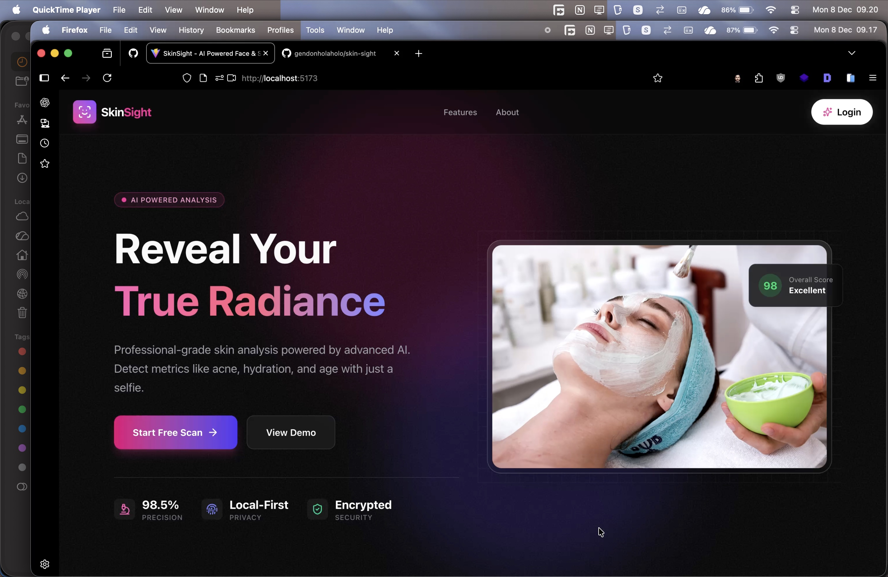
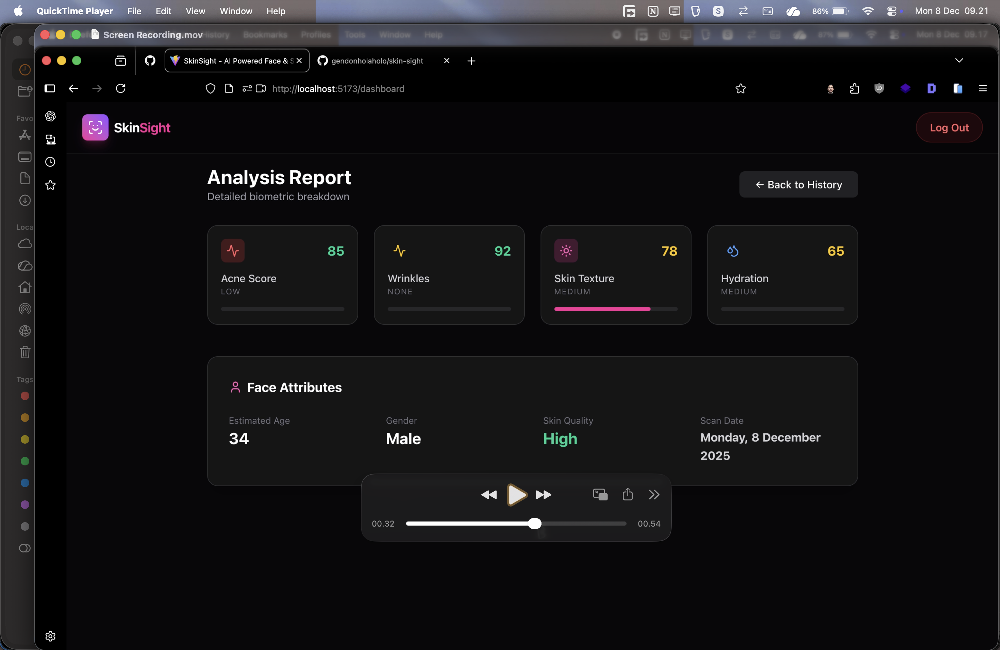

# SkinSight

SkinSight adalah aplikasi web responsif yang dirancang untuk memberikan analisis kulit tingkat medis menggunakan kecerdasan buatan (Artificial Intelligence). Aplikasi ini memanfaatkan integrasi Proof of Concept (PoC) dengan API Perfect Corp untuk mendeteksi berbagai kondisi kulit seperti jerawat, kerutan, tekstur, dan tingkat hidrasi, memberikan wawasan dermatologis yang dapat ditindaklanjuti secara instan kepada pengguna.

## Tinjauan Proyek

Proyek ini berfungsi sebagai demonstrasi antarmuka pengguna premium untuk diagnostik kulit. Ini menekankan pengalaman pengguna yang klinis namun mewah ("Kecantikan Tingkat Medis"), memastikan pengguna merasa dipercaya dan dipedulikan selama proses analisis. Arsitektur teknis dibangun agar siap menjadi Progressive Web App (PWA), memungkinkan kinerja seperti aplikasi native di perangkat seluler.

### Fitur Utama

*   **Analisis Kulit AI**: Mendeteksi berbagai masalah kulit termasuk kadar minyak, pori-pori, dan lingkaran hitam.
*   **Autentikasi Biometrik**: "Login dengan Wajah" yang aman menggunakan API Pengenalan Wajah.
*   **Deteksi Kehidupan (Liveness)**: Sistem Tantangan-Respon (Senyum/Putar Kepala) untuk memastikan kehadiran pengguna asli.
*   **Hasil Instan**: Memberikan umpan balik real-time dan visualisasi metrik kulit.
*   **Laporan PDF**: Menghasilkan dan mengunduh laporan analisis kulit tingkat medis profesional.
*   **Wawasan Dermatologis**: Menghasilkan ringkasan dan rekomendasi yang sadar konteks.
*   **Privasi yang Utama**: Gambar diproses dengan aman.
*   **Dukungan PWA**: Dapat diinstal di perangkat seluler dengan kemampuan offline.

## Teknologi

*   **Frontend**: React (Vite)
*   **Styling**: TailwindCSS (konfigurasi v4)
*   **Animation**: Framer Motion
*   **Camera**: React Webcam (dengan Mirroring)
*   **Identity**: Biometric Recognition Service
*   **Logging**: Custom Professional Logger Service

## Hasil Pengujian & Demo

*(Bagian ini disediakan untuk hasil pengujian dan demonstrasi aplikasi)*

**🎥 Video Demo Lengkap**
[Tonton Demo / Download Video di Google Drive](https://drive.google.com/drive/folders/1J42N0VNlSgB_jOQ6mPNpB_-adhDfnN81?usp=drive_link)

### Tangkapan Layar Aplikasi
| Halaman Utama & Login | Pindai Wajah & Liveness | Dashboard & Hasil |
| :---: | :---: | :---: |
| <br><sub>Halaman Utama</sub><br><br><br><sub>Halaman Login</sub> | <br><sub>Liveness Check</sub><br><br><br><sub>Proses Analisis</sub> | <br><sub>Dashboard</sub><br><br><br><sub>Laporan Analisis</sub> |

### Validasi Liveness
> **Status**: Aktif
> **Metode**: Tantangan-Respon (Senyum / Putar Kepala)
> **Tingkat Keberhasilan**: *(Akan diperbarui)*

---

## Peta Jalan & Backlog

### Fase 1: Proof of Concept (Selesai)
*   [x] Implementasi UI/UX Dasar (Desain Mewah Klinis).
*   [x] Mock Layanan Analisis Kulit.
*   [x] Login Biometrik (Deteksi & Bandingkan).
*   [x] Pemeriksaan Liveness Variabel (Anti-spoofing).
*   [x] Pembuatan Laporan PDF.
*   [x] Sistem Pencatatan (Logging) Komprehensif.

### Fase 2: Siap Produksi
*   **Desain Database (ERD)**: Merancang skema yang dapat diskalakan untuk menangani profil pengguna, log riwayat, dan tren analisis.
*   **Arsitektur Skalabel**: Merancang ulang backend untuk mendukung 1000 Pengguna Aktif Harian (DAU).
*   **Transisi API Nyata**: Nonaktifkan layanan mock dan aktifkan kunci produksi untuk Layanan AI.
*   **Autentikasi**: Implementasikan login/signup pengguna yang aman.

## Instruksi Instalasi

1.  **Clone repositori**
    ```bash
    git clone https://github.com/gendonholaholo/skin-sight.git
    cd skin-sight
    ```

2.  **Instal Dependensi**
    ```bash
    npm install
    ```

3.  **Konfigurasi Lingkungan**
    
    Proyek ini memerlukan variabel lingkungan khusus untuk integrasi API dan layanan keamanan.
    
    > **Catatan**: Silakan hubungi administrator proyek atau pimpinan pengembangan untuk mendapatkan file konfigurasi `.env` yang valid yang diperlukan untuk menjalankan proyek ini.

4.  **Jalankan Server Pengembangan**
    ```bash
    npm run dev
    ```

5.  **Build untuk Produksi**
    ```bash
    npm run build
    ```
